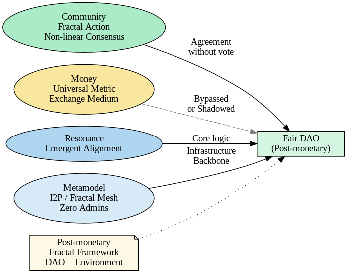

# Fair DAO MetaMap

## Core Concepts

Fair DAO is not merely a Decentralized Autonomous Organization — it’s a **Fractal Agreement Framework**, where:

* **D** stands for **Distributed/Decentralized Decisions**
* **A** for **Agreements** formed in local cells
* **O** for **Oikonomia** — the collective ecological intelligence, not "organization"

> 🌿 "Fair DAO is a network of voluntarily aligned fractals of action, not a formalized contract."

---

## Post-Monetary Intention

While monetary systems dominate most DAOs (Ethereum, Solana, TON, etc.), Fair DAO explores:

* **Non-monetary coordination**
* **Local resonance as consensus**
* **Fluid identity, morphable networks**

> "Because money seems universal and concrete, it absorbs everything into itself, turning any system into a money-extraction machine."

Fair DAO reverses this:

* Keeps **measure**, drops **universality**
* Treats **exchange** as **epiphenomenon**, not the goal

---

## Memplex: Cultural DNA

Fair DAO emerges from:

* **Mythos**: Prometheus, Robin Hood, Siddhartha
* **Memeplex**: Hacker ethics, Open culture, Fractal civics

---

## Infrastructure & Ecosystem

* **Mesh of Things (MoT)**: Fractal local mesh hardware
* **DAO**: Self-forking logic, no fixed root DAO
* **Shadow Systems**: Anonymous communication, darknets, grey economy
* **Resilience loops** vs. surveillance capitalism

> 🔬 "Surveillance is replaced by biosphere defense nets, run by people’s assemblies or biosphere DAOs"

---

## Symbolic Structure (Diagram Legend)

* 🧬 Fractal meshes: Autonomous sub-DAO cells
* 🔗 MoT: Embedded physical-digital mesh
* 🛠️ Shadow Systems: Non-trackable interaction protocols
* 📡 Surveillance Tech (Leviathan side): Palantir, PRISM, etc.

---

## Strategic Position

Fair DAO aims to:

* Escape Leviathan’s memetic gravity
* Reclaim **narrative sovereignty**
* Reinvent governance from first principles

---

## Next Steps

* Implement dynamic identity systems
* Link this with i2p ecosystem (Gostcoin, PurpleI2P, i2pd)
* Build community of non-tokenized governance cells

---

**Source**: [GitHub Repo](https://github.com/nonlin-lin-chaos-order-etc-etal/fairstate)

> *This file auto-generated with 🧠 ChatGPT & 🛠️ open collaboration. The path to image file updated by nonlin-lin-chaos-order-etc-etal-etmore.*
